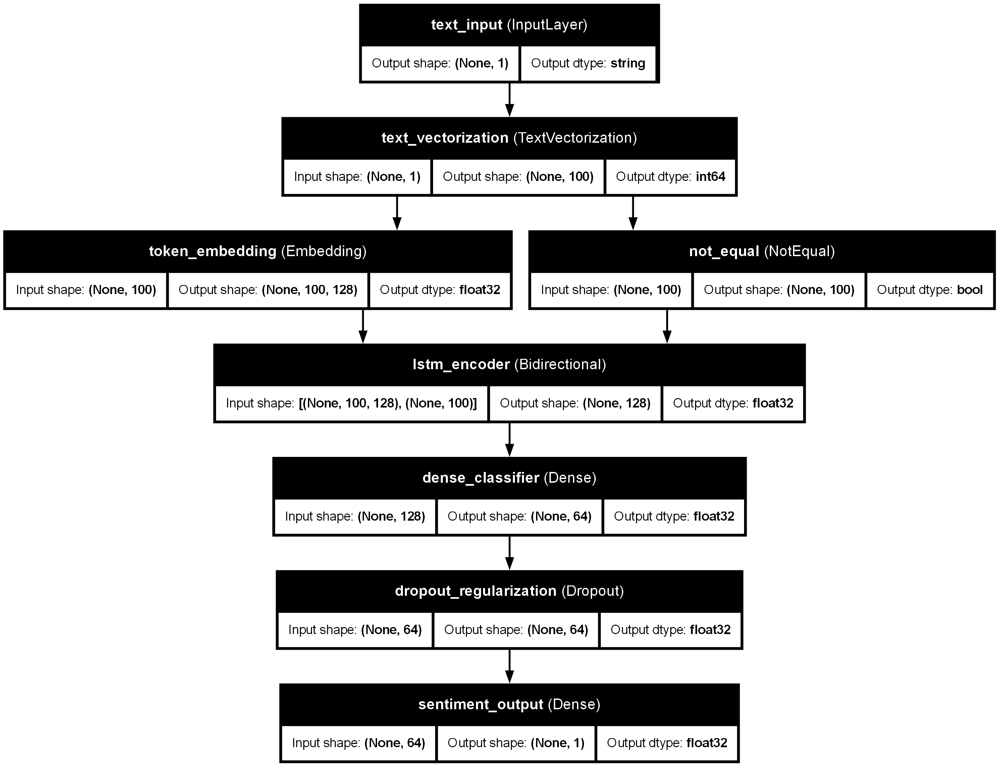

# Sentiment Analysis API

This project is an end-to-end NLP application that performs sentiment analysis using a deep learning model (BiLSTM) and serves predictions through a FastAPI REST API.

---

## Table of Contents

- [Features](#features)
- [Tech Stack](#tech-stack)
- [Project Structure](#project-structure)
- [Installation](#installation)
- [Train the Model](#train-the-model)
- [Run the API](#run-the-api)
- [API Documentation](#api-documentation)
- [Example Request](#example-request)
- [Example Response](#example-response)
- [Model Architecture](#model-architecture)
- [Future Improvements](#future-improvements)

---

## Features

- Deep learning model built with TensorFlow (Embedding + BiLSTM)
- Text preprocessing integrated into the model
- REST API using FastAPI
- Real-time sentiment prediction
- Ready for containerization with Docker

---

## Tech Stack

- Python
- TensorFlow
- FastAPI
- Uvicorn
- Scikit-learn

---

## Project Structure

```text
sentiment-analysis-api/
├── app/
├── model/
├── data/
├── notebooks/
├── README.md
├── requirements.txt
└── .gitignore
```

---

## Installation

```bash
python -m venv venv
source venv/Scripts/activate
pip install -r requirements.txt
```

---

## Train the Model

```bash
python model/train.py
```

---

## Run the API

```bash
uvicorn app.main:app --reload
```

---

## API Documentation

Once the API is running, open:

`http://127.0.0.1:8000/docs`

---

## Example Request

```json
{
  "text": "I really loved this product"
}
```

---

## Example Response

```json
{
  "prediction": "positive",
  "score": 0.82
}
```

---

## Model Architecture

The sentiment analysis model is built as an end-to-end TensorFlow pipeline that takes raw text as input and outputs a binary sentiment score.

### Architecture Overview

- **InputLayer**: receives raw text as strings
- **TextVectorization**: converts text into integer token sequences of fixed length
- **Embedding**: maps each token to a dense vector representation
- **Masking via `mask_zero=True`**: ignores padding tokens (`0`) during sequence processing
- **Bidirectional LSTM**: captures contextual information from both left-to-right and right-to-left directions
- **Dense + ReLU**: learns higher-level features for classification
- **Dropout**: reduces overfitting during training
- **Dense + Sigmoid**: outputs a sentiment probability between 0 and 1

### Model Diagram



### Notes on Padding and `not_equal`

The `not_equal` node visible in the architecture graph is automatically created because the embedding layer uses:

```python
mask_zero=True
```

This allows the model to ignore padding tokens added by `TextVectorization`.  
In practice, tokens equal to `0` are treated as padding and are excluded from the LSTM sequence processing.

### Model Input / Output

- **Input**: raw text string
- **Output**: a probability between `0` and `1`
  - values close to `1` indicate **positive sentiment**
  - values close to `0` indicate **negative sentiment**

### Optional Architecture Plot Generation

The architecture PNG is generated with:

```python
tf.keras.utils.plot_model(...)
```

On Windows, Graphviz must be installed separately and added to the system `PATH`.

You can verify the installation with:

```bash
dot -V
```

If Graphviz is not installed, the model training still works normally, but the PNG architecture file will not be generated.

---

## Future Improvements

- Deploy the API on Google Cloud Run
- Replace the toy dataset with a larger real-world dataset
- Add a frontend with Streamlit or React
- Improve model performance with Transformers from Hugging Face